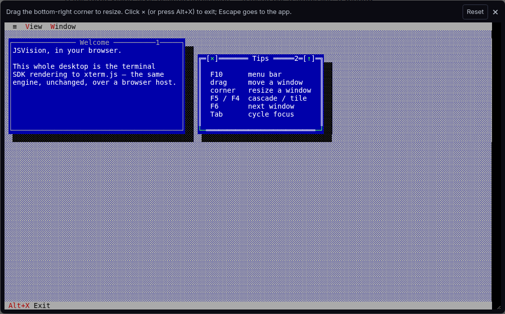
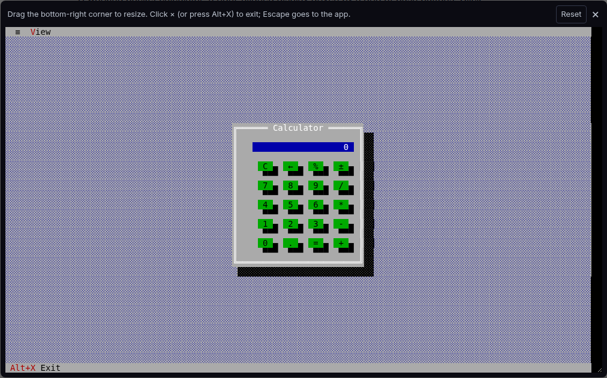
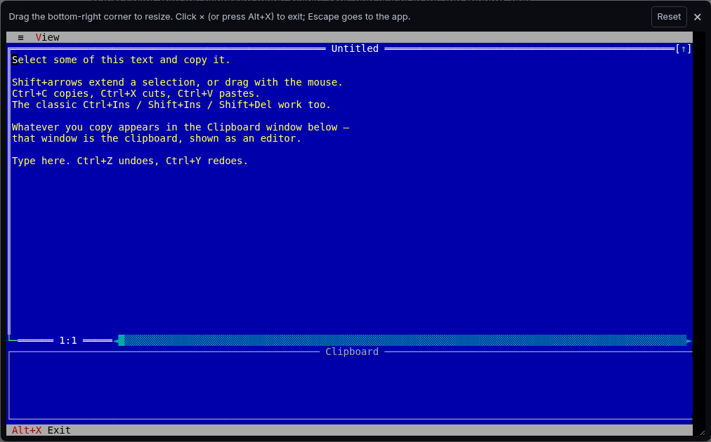

# jsvision

[](https://github.com/blendsdk/jsvision/actions/workflows/ci.yml?query=branch%3Amaster+event%3Apush)
[](https://www.npmjs.com/package/@jsvision/core)
[](https://www.npmjs.com/package/@jsvision/core)
[](LICENSE)

An SDK for building **Turbo Vision-style terminal (TUI) applications** in TypeScript —
a retained widget framework with fine-grained reactivity, on top of a pure,
zero-dependency rendering engine.

## See it in action

The same JSVision applications run in a native terminal and in the browser through
xterm.js. Click a screenshot to open its interactive version.

[](https://blendsdk.github.io/jsvision/apps/desktop?example=apps%2Fdesktop)

|                                 [Calculator](https://blendsdk.github.io/jsvision/apps/calculator?example=apps%2Fcalculator)                                 |                              [Editor & clipboard](https://blendsdk.github.io/jsvision/apps/editor?example=apps%2Feditor)                              |
| :---------------------------------------------------------------------------------------------------------------------------------------------------------: | :---------------------------------------------------------------------------------------------------------------------------------------------------: |
| [](https://blendsdk.github.io/jsvision/apps/calculator?example=apps%2Fcalculator) | [](https://blendsdk.github.io/jsvision/apps/editor?example=apps%2Feditor) |

## 📖 Documentation

The full guide, live component gallery, and API reference live on the documentation
site: **<https://blendsdk.github.io/jsvision/>**

- [Guide](https://blendsdk.github.io/jsvision/guide/) — build your first app
- [Components](https://blendsdk.github.io/jsvision/components/) — the widget catalog, running live
- [API reference](https://blendsdk.github.io/jsvision/api/)

## Published packages

| Package                                         | What it is                                                                                                        |
| ----------------------------------------------- | ----------------------------------------------------------------------------------------------------------------- |
| [`@jsvision/core`](packages/core)               | Zero-dependency rendering engine, terminal host, input decoding, capability detection, colour, and safety.        |
| [`@jsvision/ui`](packages/ui)                   | Retained widget tree, fine-grained signals, layout, application shell, event loop, themes, and controls.          |
| [`@jsvision/i18n`](packages/i18n)               | Zero-dependency internationalization for JSVision applications and packages.                                      |
| [`@jsvision/forms`](packages/forms)             | Headless reactive form and field state with synchronous Zod validation.                                           |
| [`@jsvision/files`](packages/files)             | File open/save, directory chooser, file list, directory list, file input, and file-information controls.          |
| [`@jsvision/datagrid`](packages/datagrid)       | Editable data grid with typed columns, per-cell editing, filtering, sorting, grouping, and virtual scrolling.     |
| [`@jsvision/code-editor`](packages/code-editor) | Terminal-native source editor with document lifecycle, search, replace, folding, syntax highlighting, and LSP UI. |

The private [`@jsvision/web`](packages/web) workspace powers the browser examples; it
is not currently published to npm.

## Install

```bash
npm install @jsvision/core @jsvision/ui
```

ESM-only. Requires Node.js **≥ 22**. See the
[Guide](https://blendsdk.github.io/jsvision/guide/) to build your first app.

## Development

This is a yarn 1.x + Turborepo monorepo. From the repo root:

```bash
yarn install
yarn verify   # lint + typecheck + build + test across all packages
```

All public packages share one lockstep version. For the full workflow, see the
[development guide](https://blendsdk.github.io/jsvision/reference/guides/development).

## Versioning & stability

jsvision follows [Semantic Versioning](https://semver.org/). Each package's entry point
is its stable public surface, and breaking changes ship only in a **major** release.
Anything marked `@deprecated` is kept for at least one minor release before removal.
All public packages share one lockstep version, and notable changes are recorded in
each package's `CHANGELOG.md` and on the
[GitHub Releases page](https://github.com/blendsdk/jsvision/releases).

## License

[MIT](LICENSE)
