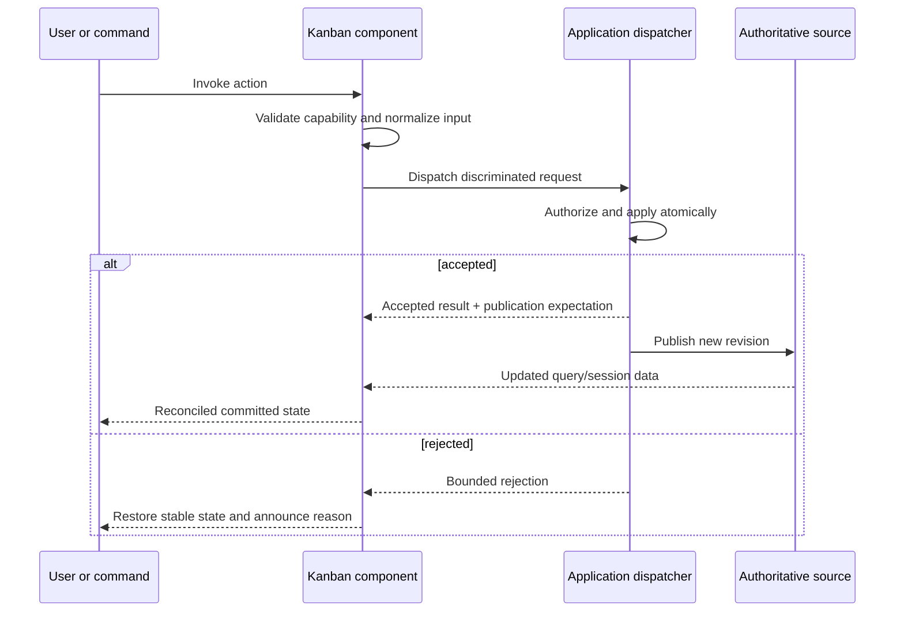
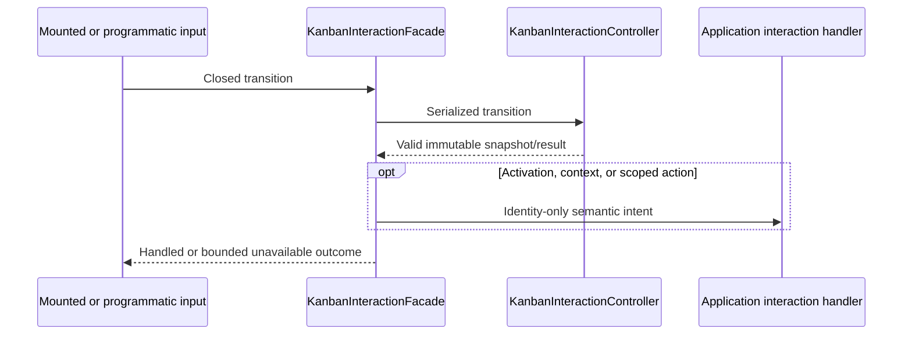

# Kanban API design

> **Last Updated**: 2026-08-15
> **Status**: Phase D board and productivity API implemented; consumer course remains later work

## API style

`@jsvision/kanban` is a browser-neutral, typed in-process SDK. Its main barrel exposes models,
adapters, presentation, scene, interaction, view, editing, configuration, action, event, history,
request, board, and viewport surfaces. Locale catalogs use explicit locale subpaths, and deterministic
fixtures use a `/testing` subpath. The design deliberately avoids separate `/model` or `/dialogs`
subpaths so related contracts share one supported production entry.

## Public topology

| Surface                        | Purpose                                                | Authority                                        |
| ------------------------------ | ------------------------------------------------------ | ------------------------------------------------ |
| `KanbanBoard<TCard>`           | DSL-composed board component                           | Component session state                          |
| `KanbanDataSource<TCard>`      | Open a coherent query session                          | Application/data adapter                         |
| Query session and cell cursor  | Bounded lazy acquisition and edge/count knowledge      | Data adapter                                     |
| Card adapter/descriptors       | Map arbitrary records to safe visual content           | Application/package adapter                      |
| Structure/grouping policy      | Normalize columns and one optional swimlane axis       | Application policy; component projection         |
| Workflow evaluators            | Report WIP, DoD, and transition eligibility            | Pure presentation logic; never authorization     |
| Swimlane presentation          | Resolve bounded built-in or custom header chrome       | Component with validated application extension   |
| Scene and hit-map contracts    | Project final clipped geometry and semantic targets    | Viewport; application extensions remain bounded  |
| `KanbanInteractionFacade`      | Programmatic focus, selection, activation, context     | Stable board session surface                     |
| Interaction controller factory | Replace the mount-owned semantic state controller      | Ownership transfers to one board                 |
| Interaction intents            | Notify open-card, context, and scoped application UI   | Identity-only; never mutation authority          |
| `KanbanRequest` dispatcher     | Carry every requested mutation atomically              | Application                                      |
| Operation coordinator          | Validate, reserve, dispatch, reconcile, cancel, undo   | Board session; source remains authoritative      |
| Drag controllers/drop map      | Card and structural pointer movement                   | Viewport-local semantic geometry                 |
| `KanbanViewController`         | Own one transactional semantic view projection         | Component session state                          |
| Saved-view codec/store helpers | Validate, migrate, reconcile, and propose persistence  | Values in package; storage in application        |
| `KanbanCardEditorAdapter`      | Map records to detached typed drafts and proposals     | Application adapter; package session lifecycle   |
| `KanbanConfigurationSession`   | Collect one validated column or swimlane operation     | Package draft; application structure authority   |
| `KanbanActionRegistry`         | Unify package/application actions and capabilities     | Package vocabulary plus application extensions   |
| `KanbanEventHub`               | Publish bounded payload-free board events              | Board-scoped transient observability             |
| `KanbanHistoryBinding`         | Invoke fresh application-owned undo/redo proposals     | Availability and stacks remain application-owned |
| `/testing`                     | Fake clock, host trace, dispatcher/lifecycle harnesses | Development-only public SDK surface              |

## Request protocol

Data-operation requests use this dispatcher. Card moves, selected-card moves, column/swimlane reorder,
programmatic movement, editor/configuration submission, saved-view persistence, actions, and history
proposals preserve that boundary. A move uses destination column/swimlane identity plus a semantic
placement snapshot or bounded opaque edge token. The component never writes rank fields or guesses
persistence semantics.

The implementation exposes exact standard proposal and coordinator-owned envelope unions plus the
compatible namespaced extension envelope, captured board/source/query/entity revisions, four
operation-correlated result variants, bounded publication expectations, cancellation, fresh-proposal
undo, and pure reconciliation. Requests, contexts, results, and publication notices are
copied through descriptor-only exact-shape validation before application data is retained or used.
Capability descriptions control presentation only and are never treated as authorization.

## View and saved-view protocol

`KanbanViewController` exposes immutable state, draft and committed search, closed transitions,
transactional replacement, subscription, and disposal. Board binding translates the controller's
semantic projection into the legacy query/presentation channels without creating another state owner.
A query-changing transition prepares a source session and viewport candidate before one batched commit;
failure restores the previous controller state, query identity, and visible projection.

Saved views are bounded versioned semantic values. `captureKanbanSavedView` excludes focus, scroll,
loaded windows, pending operations, and dialog state. `parseKanbanSavedView`, migration, and
reconciliation operate on detached input and return typed diagnostics rather than partially applying
unknown data. Applying a reconciled view uses the controller's atomic replacement seam.
`createKanbanSavedViewStore` owns no records: save, rename, and delete are validated proposals sent to
application authority.

## Editor and configuration protocol

`KanbanCardEditorAdapter<TCard, TDraft>` separates application records from editable detached drafts.
The schema registry validates bounded sections, fields, control factories, and callbacks before a
session starts. Editor sessions own abort generations, field validation, first-error focus, dirty and
stale state, and exact full-draft proposals. The coordinator provides identity exclusivity, while
create/edit/view dialogs and the modeless inspector reuse the same lifecycle. The standard adapter is
the only layer coupled to `@jsvision/forms` and the Zod 4 peer.

`KanbanConfigurationSession` follows the same pattern for add, update, reorder, delete, and grouping
operations. Programmatic builders and responsive column/swimlane dialogs produce the same proposal
shapes. Result-only completion returns a detached value; authority completion enters the normal board
request coordinator and waits for authoritative publication. Destructive confirmation and focus
recovery stay explicit.

## Action, event, and history protocol

`KanbanActionRegistry` combines a bounded package inventory with namespaced application actions. The
keymap normalizes host chords and rejects conflicts or unreachable bindings atomically; the router
checks the current capability snapshot before invoking a handler. Menu, context, status, keyboard,
pointer, and programmatic entry points therefore share one action identity. Read-only capability hides
or disables mutation affordances but never replaces application authorization.

`KanbanEventHub` snapshots only bounded identifiers, revisions, states, reason codes, and counts.
Publication is dequeue-ordered, nested publication is breadth-first, and subscriber failures cannot
stop later subscribers. Optional retention is bounded and off by default. `KanbanHistoryBinding`
subscribes to application-provided availability and builds a fresh current-revision request for every
undo or redo invocation; it never retains application stacks, records, drafts, or undo tokens.

## Interaction protocol

`KanbanBoard.interaction()` returns the same stable facade throughout construction, mount, and
disposal. `accept()` provides synchronous event-loop admission; `transition()` provides serialized
settlement; `activate()`, `openContext()`, and `invokeScopedAction()` deliver semantic application
intents after required selection/focus work. The default controller comes from
`createKanbanInteractionController`; an injected factory transfers one controller exclusively to the
mounted board.

A standalone `KanbanViewport` may subscribe to `board.interaction()` as a read-only projection mirror.
That adapter transfers neither controller ownership nor keyboard/pointer input authority; only the
owning `KanbanBoard` attaches the facade's synchronous input seam during its mount transaction.

Keyboard and pointer routing operate on final semantic scene targets. The routers are public only
from `@jsvision/kanban/testing`; production hosts use the mounted board path. Unknown gestures remain
unhandled. Click completion requires matching target/revision evidence. Threshold-crossing movement
acquires a generation-bound lease and routes through the density-aware drop map, one-cell hysteresis,
bounded prefetch/hover, and two-axis autoscroll before one valid release hands a semantic proposal to
the coordinator.

### Shared UI capture prerequisite

`@jsvision/ui` now exposes `EventLoop.acquireCapture(view, onLost)` and the matching
`DispatchEvent.acquireCapture` seam. A successful acquisition returns a generation-bound lease. Its
`active()` query reports whether that exact generation still owns capture, and `release()` ends only
that generation. Replacement and every lifecycle-loss path synchronously detach the lease before
invoking its callback, so callback code cannot accidentally act through stale capture state.

Loss reasons distinguish replacement, explicit release, modal transitions, host lifecycle loss,
unmount, stop, and disposal. An unmount boundary remains active until the removed subtree's reactive
owner is disposed, preventing a cleanup callback from reacquiring capture for a dying view. Stale
leases retain only their detached state cell rather than the event loop or captured view.

The legacy `setCapture()`, `hasCapture()`, and `releaseCapture()` methods remain supported for
existing controls. New cleanup-sensitive gestures should use the lease API and confirm that the
returned lease is still active before starting gesture-owned resources. Kanban card and structural
drag controllers use this lifecycle; see
[ADR-014](/decisions/ADR-014-generation-bound-pointer-capture).

## Operation and drag conventions

- Standard caller proposals are detached and validated before the coordinator allocates the final
  operation ID and dispatch envelope.
- Affected card, column, and swimlane subjects serialize conflicting operations while unrelated
  subjects may proceed concurrently within configured bounds.
- Pending visuals are projection-only. Accepted dispatch does not mutate records and becomes committed
  only through exact authoritative publication evidence.
- Card and structure drags keep capture, timers, prefetch, hover, and overlays under one generation;
  every cancellation path is idempotent and late continuations are inert.
- Keyboard `Ctrl+Shift+Left/Right` and `board.moveFocusedCard()` use the same move authority without
  synthesizing pointer-only ghost geometry.

## Query and pagination conventions

- A board-wide query session freezes one semantic query and revision.
- Each column/swimlane intersection exposes a sparse cursor independently.
- Cursors distinguish exact, lower-bound, unknown, loading, and failed count/edge states.
- Range requests are cancellable, deduplicated, concurrency-bounded, and safe when completed stale.
- Eager sources adapt to the same contract so small and large boards share one component path.

The main entry now exports the source/session/cursor contracts, validation helpers, eager source, count
snapshots, cell addresses, placements, and state unions. Deterministic eager/windowed fixtures,
deferred controls, revision controls, and black-box contract harnesses live only under
`@jsvision/kanban/testing`; production modules never import that testing graph.

Eager query adapters register an explicit search predicate, filter operators, and exact three-way
sort comparators. An optional reactive application revision invalidates a stable outer card array when
in-place fields used by those adapters change.
Summary adapters declare `authoritative` or `loaded-only` scope and use the package-owned `sum`,
`min`, `max`, or `average` aggregation vocabulary. Empty numeric summaries remain unknown rather than
being silently reported as zero.

## Workflow and grouping conventions

- `snapshotKanbanStructurePolicy()` validates complete immutable column and optional grouping
  policy without retaining hostile caller shapes.
- Pure WIP, definition-of-done, and transition evaluators return localized reason keys and never
  dispatch, persist, or authorize an operation.
- `resolveKanbanGrouping()` accepts either registered derived grouping or explicit source
  memberships for the one field selected by the query. Visible and detached projections remain
  separate.
- Applications configure distinct unassigned and resolver-fallback groups. Resolver failures are
  contained locally and observed without card data.
- Swimlane presentation supports `hybrid`, `separator`, `band`, and `rail` variants plus bounded
  custom header-only chrome. Custom results are cached by complete semantic and geometry input under
  a fixed retention ceiling.
- `KanbanCollapsedHoverController` owns one temporary, cancellable, generation-safe expansion lease;
  it never changes the underlying collapsed policy.

## Card presentation conventions

- `KanbanCardAdapter<TCard>` reads stable identity and optional standard fields from an opaque
  application record without taking ownership of it.
- `KanbanCardRenderer<TCard>` returns a renderer-neutral descriptor constrained by an exact width and
  row budget.
- Descriptor validation snapshots caller data once, rejects accessors and non-plain shapes, enforces
  collection and UTF-8 limits, and verifies terminal-cell geometry before publication.
- Renderer failures degrade to a sanitized, deterministic title/status fallback instead of escaping
  application payloads through diagnostics.
- Semantic Kanban theme roles resolve through mapped Core roles, family fallbacks, and emergency
  styles while retaining non-color cues.
- The main entry exports the typed foundation, Phase B, Phase C, and Phase D inventories plus isolated
  English fallback services. Each explicit locale subpath preserves its foundation symbol and adds
  reviewed `kanbanPhaseB*`, `kanbanPhaseC*`, and `kanbanPhaseD*` overlays; the locale helper composes
  them in deterministic order.

## Error conventions

Errors and results are typed and bounded by category: invalid input, unavailable capability, stale
revision, policy rejection, source failure, cancellation, and internal degradation. Interaction
setup/settlement failures become unavailable results over the last valid snapshot. User-facing text
comes from localized package messages; observations contain identifiers and categories rather than
record data.

## Stability boundary

The package publishes ESM declarations and JavaScript with `sideEffects: false`. Public API changes
follow package semantic versioning. Locale keys, saved-view schemas, discriminants, defaults, and
testing utilities are supported SDK surfaces and require compatibility evidence.
