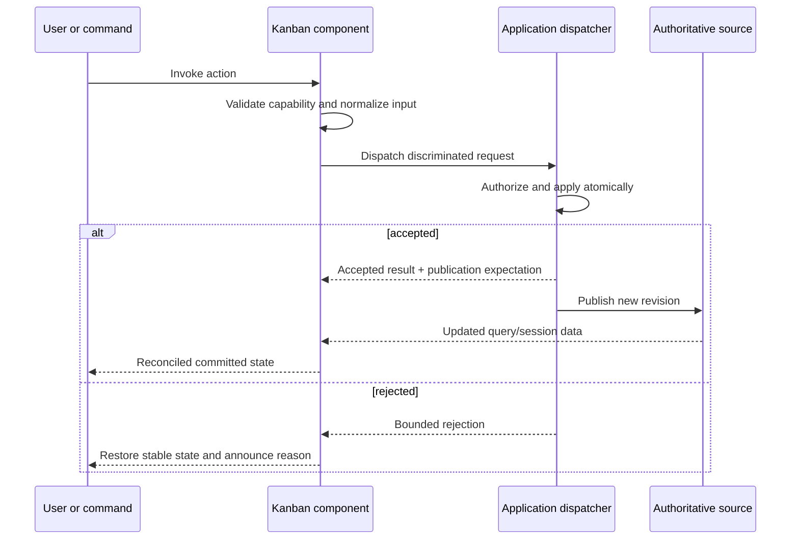

# Kanban API design

> **Last Updated**: 2026-08-04
> **Status**: Contracts and source/session APIs implemented; board, presentation adapter, and dialogs planned

## API style

`@jsvision/kanban` is a browser-neutral, typed in-process SDK. Its main barrel exposes models,
adapters, the board, commands, and package-owned dialogs. Locale catalogs use explicit locale
subpaths, and deterministic fixtures use a `/testing` subpath. The design deliberately avoids
separate `/model` or `/dialogs` public subpaths.

## Public topology

| Surface                       | Purpose                                             | Authority                                         |
| ----------------------------- | --------------------------------------------------- | ------------------------------------------------- |
| `KanbanBoard<TCard>`          | DSL-composed board component                        | Component session state                           |
| `KanbanDataSource<TCard>`     | Open a coherent query session                       | Application/data adapter                          |
| Query session and cell cursor | Bounded lazy acquisition and edge/count knowledge   | Data adapter                                      |
| Card adapter/descriptors      | Map arbitrary records to safe visual content        | Application/package adapter                       |
| `KanbanRequest` dispatcher    | Carry every requested mutation atomically           | Application                                       |
| Commands and keymap           | Keyboard/menu/programmatic actions                  | Component, gated by capabilities                  |
| Card/configuration dialogs    | Collect validated request inputs                    | Package UI; application decides whether to invoke |
| Saved-view codec              | Validate and migrate durable semantic configuration | Package codec; application storage                |

## Request protocol

Create, edit, move, reorder, configure, bulk, and undo/redo intents all use this dispatcher. A move
uses destination column/swimlane identity plus an opaque placement token. The component never writes
rank fields or guesses persistence semantics.

The implemented foundation currently exposes a namespaced extension request envelope, captured
board/source/query/entity revisions, four operation-correlated result variants, bounded publication
expectations, and pure reconciliation. Requests, contexts, results, and publication notices are
copied through descriptor-only exact-shape validation before application data is retained or used.
Capability descriptions control presentation only and are never treated as authorization.

## Query and pagination conventions

- A board-wide query session freezes one semantic query and revision.
- Each column/swimlane intersection exposes a sparse cursor independently.
- Cursors distinguish exact, lower-bound, unknown, loading, and failed count/edge states.
- Range requests are cancellable, deduplicated, concurrency-bounded, and safe when completed stale.
- Eager sources adapt to the same contract so small and large boards share one component path.

The main entry now exports the source/session/cursor contracts, validation helpers, eager source, count
snapshots, cell addresses, placements, and state unions. Deterministic eager/windowed fixtures,
deferred controls, revision controls, and black-box contract harnesses live only under
`@jsvision/kanban/testing`; production modules never import that testing graph.

Eager query adapters register an explicit search predicate, filter operators, and exact three-way
sort comparators. An optional reactive application revision invalidates a stable outer card array when
in-place fields used by those adapters change.
Summary adapters declare `authoritative` or `loaded-only` scope and use the package-owned `sum`,
`min`, `max`, or `average` aggregation vocabulary. Empty numeric summaries remain unknown rather than
being silently reported as zero.

## Error conventions

Errors are typed and bounded by category: invalid input, unavailable capability, stale revision,
policy rejection, source failure, cancellation, and internal degradation. User-facing text comes from
localized package messages; observations contain identifiers and categories rather than record data.

## Stability boundary

The package publishes ESM declarations and JavaScript with `sideEffects: false`. Public API changes
follow package semantic versioning. Locale keys, saved-view schemas, discriminants, defaults, and
testing utilities are supported SDK surfaces and require compatibility evidence.
