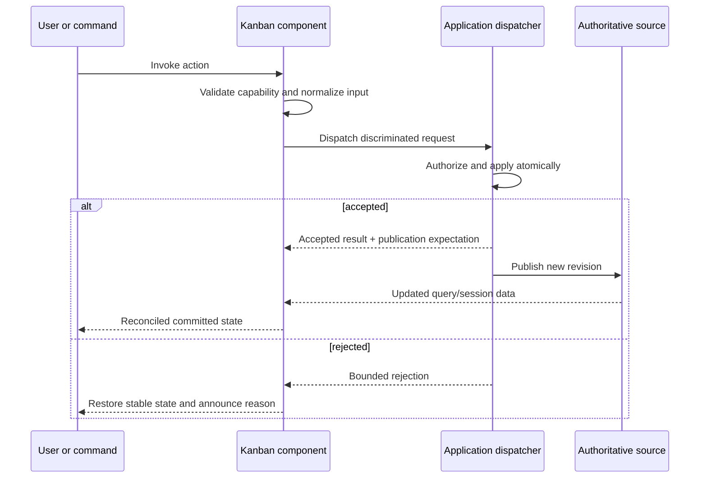
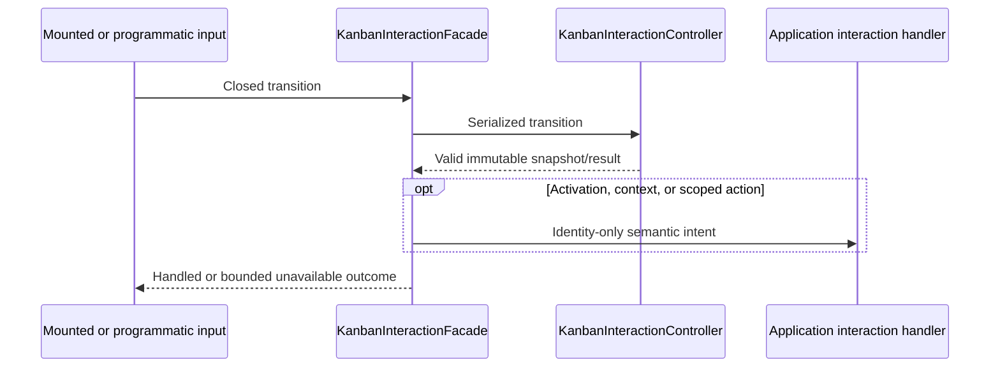

# Kanban API design

> **Last Updated**: 2026-08-10
> **Status**: Phase B core-board API implemented; drag/drop, commands, editors, and saved-view codecs planned

## API style

`@jsvision/kanban` is a browser-neutral, typed in-process SDK. Its main barrel exposes models,
adapters, presentation, scene, interaction, the board, and viewport. Locale catalogs use explicit
locale subpaths, and deterministic fixtures use a `/testing` subpath. Commands and package-owned
dialogs remain deferred; the design deliberately avoids separate `/model` or `/dialogs` subpaths.

## Public topology

| Surface                        | Purpose                                              | Authority                                       |
| ------------------------------ | ---------------------------------------------------- | ----------------------------------------------- |
| `KanbanBoard<TCard>`           | DSL-composed board component                         | Component session state                         |
| `KanbanDataSource<TCard>`      | Open a coherent query session                        | Application/data adapter                        |
| Query session and cell cursor  | Bounded lazy acquisition and edge/count knowledge    | Data adapter                                    |
| Card adapter/descriptors       | Map arbitrary records to safe visual content         | Application/package adapter                     |
| Structure/grouping policy      | Normalize columns and one optional swimlane axis     | Application policy; component projection        |
| Workflow evaluators            | Report WIP, DoD, and transition eligibility          | Pure presentation logic; never authorization    |
| Swimlane presentation          | Resolve bounded built-in or custom header chrome     | Component with validated application extension  |
| Scene and hit-map contracts    | Project final clipped geometry and semantic targets  | Viewport; application extensions remain bounded |
| `KanbanInteractionFacade`      | Programmatic focus, selection, activation, context   | Stable board session surface                    |
| Interaction controller factory | Replace the mount-owned semantic state controller    | Ownership transfers to one board                |
| Interaction intents            | Notify open-card, context, and scoped application UI | Identity-only; never mutation authority         |
| `KanbanRequest` dispatcher     | Carry every requested mutation atomically            | Application                                     |
| Commands, dialogs, saved views | Planned application-facing layers                    | Deferred; not exported in Phase B               |

## Request protocol

Data-operation requests use this dispatcher. Future create, edit, move, reorder, configure, bulk, and
undo/redo UI paths must preserve that boundary. A move uses destination column/swimlane identity plus
an opaque placement token. The component never writes rank fields or guesses persistence semantics.

The implemented foundation currently exposes a namespaced extension request envelope, captured
board/source/query/entity revisions, four operation-correlated result variants, bounded publication
expectations, and pure reconciliation. Requests, contexts, results, and publication notices are
copied through descriptor-only exact-shape validation before application data is retained or used.
Capability descriptions control presentation only and are never treated as authorization.

## Interaction protocol

`KanbanBoard.interaction()` returns the same stable facade throughout construction, mount, and
disposal. `accept()` provides synchronous event-loop admission; `transition()` provides serialized
settlement; `activate()`, `openContext()`, and `invokeScopedAction()` deliver semantic application
intents after required selection/focus work. The default controller comes from
`createKanbanInteractionController`; an injected factory transfers one controller exclusively to the
mounted board.

A standalone `KanbanViewport` may subscribe to `board.interaction()` as a read-only projection mirror.
That adapter transfers neither controller ownership nor keyboard/pointer input authority; only the
owning `KanbanBoard` attaches the facade's synchronous input seam during its mount transaction.

Keyboard and pointer routing operate on final semantic scene targets. The routers are public only
from `@jsvision/kanban/testing`; production hosts use the mounted board path. Unknown gestures remain
unhandled. Click completion requires matching target/revision evidence, and drag reports cancel the
press because insertion/drop contracts are deferred.

## Query and pagination conventions

- A board-wide query session freezes one semantic query and revision.
- Each column/swimlane intersection exposes a sparse cursor independently.
- Cursors distinguish exact, lower-bound, unknown, loading, and failed count/edge states.
- Range requests are cancellable, deduplicated, concurrency-bounded, and safe when completed stale.
- Eager sources adapt to the same contract so small and large boards share one component path.

The main entry now exports the source/session/cursor contracts, validation helpers, eager source, count
snapshots, cell addresses, placements, and state unions. Deterministic eager/windowed fixtures,
deferred controls, revision controls, and black-box contract harnesses live only under
`@jsvision/kanban/testing`; production modules never import that testing graph.

Eager query adapters register an explicit search predicate, filter operators, and exact three-way
sort comparators. An optional reactive application revision invalidates a stable outer card array when
in-place fields used by those adapters change.
Summary adapters declare `authoritative` or `loaded-only` scope and use the package-owned `sum`,
`min`, `max`, or `average` aggregation vocabulary. Empty numeric summaries remain unknown rather than
being silently reported as zero.

## Workflow and grouping conventions

- `snapshotKanbanStructurePolicy()` validates complete immutable column and optional grouping
  policy without retaining hostile caller shapes.
- Pure WIP, definition-of-done, and transition evaluators return localized reason keys and never
  dispatch, persist, or authorize an operation.
- `resolveKanbanGrouping()` accepts either registered derived grouping or explicit source
  memberships for the one field selected by the query. Visible and detached projections remain
  separate.
- Applications configure distinct unassigned and resolver-fallback groups. Resolver failures are
  contained locally and observed without card data.
- Swimlane presentation supports `hybrid`, `separator`, `band`, and `rail` variants plus bounded
  custom header-only chrome. Custom results are cached by complete semantic and geometry input under
  a fixed retention ceiling.
- `KanbanCollapsedHoverController` owns one temporary, cancellable, generation-safe expansion lease;
  it never changes the underlying collapsed policy.

## Card presentation conventions

- `KanbanCardAdapter<TCard>` reads stable identity and optional standard fields from an opaque
  application record without taking ownership of it.
- `KanbanCardRenderer<TCard>` returns a renderer-neutral descriptor constrained by an exact width and
  row budget.
- Descriptor validation snapshots caller data once, rejects accessors and non-plain shapes, enforces
  collection and UTF-8 limits, and verifies terminal-cell geometry before publication.
- Renderer failures degrade to a sanitized, deterministic title/status fallback instead of escaping
  application payloads through diagnostics.
- Semantic Kanban theme roles resolve through mapped Core roles, family fallbacks, and emergency
  styles while retaining non-color cues.
- The main entry exports the typed foundation and Phase B inventories plus isolated English fallback
  service. Each explicit locale subpath preserves its exact foundation symbol and adds a reviewed
  `kanbanPhaseB*` overlay; applications pass both catalogs for the complete vocabulary.

## Error conventions

Errors and results are typed and bounded by category: invalid input, unavailable capability, stale
revision, policy rejection, source failure, cancellation, and internal degradation. Interaction
setup/settlement failures become unavailable results over the last valid snapshot. User-facing text
comes from localized package messages; observations contain identifiers and categories rather than
record data.

## Stability boundary

The package publishes ESM declarations and JavaScript with `sideEffects: false`. Public API changes
follow package semantic versioning. Locale keys, saved-view schemas, discriminants, defaults, and
testing utilities are supported SDK surfaces and require compatibility evidence.
