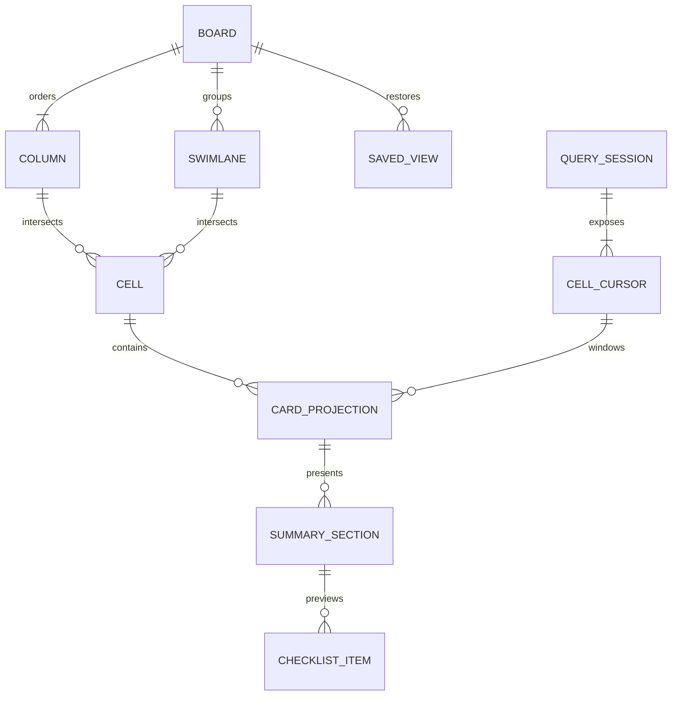

# Kanban data model

> **Last Updated**: 2026-08-04
> **Status**: Contracts, revisioned eager and sparse windowed reads, and card projections implemented

## Domain model

## Entities and value objects

| Entity           | Identity and key fields                                             | Ownership                                                 | Invariants                                                               |
| ---------------- | ------------------------------------------------------------------- | --------------------------------------------------------- | ------------------------------------------------------------------------ |
| Board definition | Board ID, ordered columns, optional swimlane dimension              | Application                                               | IDs are stable; column order is explicit                                 |
| Column           | ID, name, order, workflow metadata, WIP/DoD policy                  | Application                                               | Deletion of non-empty columns requires atomic reassignment or rejection  |
| Swimlane         | ID, label, order, visibility/collapse state                         | Application for structure; session for transient collapse | At most one grouping dimension; no nested swimlanes                      |
| Card record      | Application-defined `TCard`                                         | Application                                               | Package never mutates or persists the record directly                    |
| Card projection  | Stable ID, title/status descriptors, summaries, semantic styles     | Adapter/package                                           | Descriptor output is bounded and safe to render                          |
| Cell cursor      | Column/swimlane coordinate, revision, loaded window, edge knowledge | Query session                                             | Loaded boundaries are not assumed to be logical edges                    |
| Placement        | Destination coordinate and opaque rank token                        | Source/dispatcher contract                                | Token is semantic, bounded, and not interpreted by the view              |
| Saved view       | Version, query, grouping, order, density, visibility                | Application storage                                       | Semantic configuration only; transient focus/drag/load state is excluded |

## State ownership

| State                                                     | Owner                  | Lifetime                         |
| --------------------------------------------------------- | ---------------------- | -------------------------------- |
| Card records, workflow policy, authorization, persistence | Application            | Durable                          |
| Saved-view JSON                                           | Application            | Durable and versioned            |
| Query revision and loaded windows                         | Query session          | Until query replacement/disposal |
| Focus, selection, scroll, hover, open dialog              | Board instance         | Session                          |
| Drag ghost, insertion marker, validation request          | Board/dialog operation | Transient                        |

## Data flow

1. The application supplies a `KanbanDataSource<TCard>` and opens a revisioned query session.
2. The board asks sparse cell cursors only for visible and overscan ranges.
3. Card adapters derive bounded presentation descriptors from application records.
4. User interaction creates a normalized request carrying an expected revision and semantic
   placement where relevant.
5. The application authorizes and applies the operation, then publishes committed source state or a
   rejection. The component reconciles from that authoritative result.

## Implemented source invariants

- Source publications are validated as complete snapshots. Duplicate card keys, unknown columns, or
  invalid metadata retain the last complete eager index and emit only a bounded, payload-free
  observation.
- Card keys preserve JavaScript primitive identity, so numeric `1` and string `"1"` remain distinct.
- Sort directives are lexicographic and stable; ties retain source order.
- Counts explicitly distinguish exact, estimated, truncated, lower-bound, and unknown knowledge.
- A source reports viewport-visible count as unknown; only viewport projection can make it exact.
- Cursor ranges are normalized, coalesced, bounded, cancellable, and tied to a session generation.
- Application card objects are projected by reference; the source does not clone, mutate, or persist
  them.

## Implemented presentation invariants

- A card descriptor is an immutable snapshot containing exact-cell rows, semantic sections, bounded
  actions and hit regions, explicit degradation, and at least one non-color state marker.
- Adapter values and descriptor collections are captured once. Later caller mutation, custom array
  iteration, accessors, or changing array length cannot alter the validated snapshot.
- Text is bounded by UTF-8 bytes and terminal cells after control and bidirectional-control rejection.
- Application action IDs use a bounded namespaced grammar and cannot enter the package-reserved
  `jsvision.*` namespace.
- Theme tokens use an exhaustive package-local role inventory. Unknown roles cannot become renderable
  descriptor values.

## Compatibility and migration

Public TypeScript contracts follow package semantic versioning. Saved views use a separate explicit
schema version and package-provided decode/migration helpers. Unknown versions, oversized values, and
invalid nesting are rejected without partially applying configuration.
