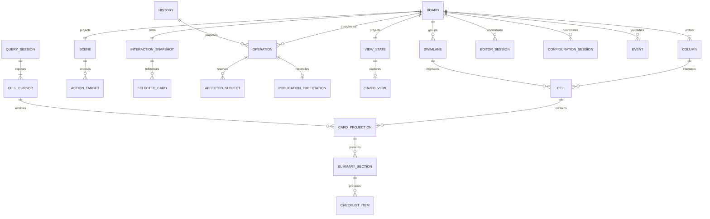

# Kanban data model

> **Last Updated**: 2026-08-15
> **Status**: Phase D board, view, editing, configuration, action, event, and history state implemented

## Domain model

## Entities and value objects

| Entity                | Identity and key fields                                              | Ownership                                                  | Invariants                                                               |
| --------------------- | -------------------------------------------------------------------- | ---------------------------------------------------------- | ------------------------------------------------------------------------ |
| Board definition      | Board ID, ordered columns, optional swimlane dimension               | Application                                                | IDs are stable; column order is explicit                                 |
| Column                | ID, name, order, workflow metadata, WIP/DoD policy                   | Application                                                | Deletion of non-empty columns requires atomic reassignment or rejection  |
| Swimlane              | ID, label, order, visibility/collapse state                          | Application for structure; board for temporary hover lease | At most one grouping dimension; no nested swimlanes                      |
| Card record           | Application-defined `TCard`                                          | Application                                                | Package never mutates or persists the record directly                    |
| Card projection       | Stable ID, title/status descriptors, summaries, semantic styles      | Adapter/package                                            | Descriptor output is bounded and safe to render                          |
| Cell cursor           | Column/swimlane coordinate, revision, loaded window, edge knowledge  | Query session                                              | Loaded boundaries are not assumed to be logical edges                    |
| Placement             | Destination coordinate and opaque rank token                         | Source/dispatcher contract                                 | Token is semantic, bounded, and not interpreted by the view              |
| Scene                 | Revision, retained rows, clipped regions, semantic targets           | Viewport                                                   | Finite visible/overscan snapshot; no application record payloads         |
| Interaction           | Revision, focus, ordered selected keys, range/pending/feedback state | Board-owned controller                                     | Detached immutable snapshot with finite selection                        |
| Interaction intent    | Kind, origin, closed scope, eligible selection snapshot              | Component to application handler                           | Identity-only evidence; never authorizes or performs mutation            |
| Operation             | ID, request, affected subjects, lifecycle state, expectation         | Board coordinator                                          | Exactly one dispatcher call; bounded retention and conflict ownership    |
| Drag overlay          | Generation, moved keys, source placeholders, target, ghost           | Viewport/controller                                        | Payload-free, clipped, capture-owned, and absent after cancellation      |
| View state            | Revision, search, filters, sort, grouping, structure, presentation   | `KanbanViewController`                                     | One immutable transactional projection; draft search is separate         |
| Saved view            | Version, query, grouping, order, density, visibility                 | Value in package; storage in application                   | Semantic configuration only; transient focus/drag/load state is excluded |
| Editor session        | Identity claim, detached draft, validation, focus, stale/submission  | Editor coordinator/session                                 | At most one edit claim per card; source record remains application-owned |
| Configuration session | Operation, detached structure draft, validation, submission          | Configuration session                                      | One column/swimlane proposal; no direct structure mutation               |
| Event                 | Board ID, sequence, kind, bounded IDs/revisions/states/counts        | `KanbanEventHub`                                           | Payload-free immutable snapshot; bounded queue and optional retention    |
| History               | Availability revision, undo/redo message IDs                         | Application provider plus package binding                  | Stack and inverse semantics remain application-owned                     |

## State ownership

| State                                                     | Owner               | Lifetime                         |
| --------------------------------------------------------- | ------------------- | -------------------------------- |
| Card records, workflow policy, authorization, persistence | Application         | Durable                          |
| Saved-view JSON                                           | Application         | Durable and versioned            |
| View state                                                | View controller     | Mounted board session            |
| Query revision and loaded windows                         | Query session       | Until query replacement/disposal |
| Focus, selection, scroll, hover, pending navigation       | Board/controller    | Mounted board session            |
| Pending press, drag ghost, insertion marker               | Viewport/controller | One capture generation           |
| Operation snapshots and undo descriptors                  | Board coordinator   | Bounded mounted-board retention  |
| Editor session and detached draft                         | Editor session      | One create/edit/view workflow    |
| Configuration session and detached structure draft        | Config session      | One column/swimlane workflow     |
| Event queue and optional retained snapshots               | Event hub           | Bounded board-scoped lifetime    |
| History availability subscription                         | History binding     | Bound application provider       |

## Data flow

1. The application supplies a `KanbanDataSource<TCard>` and opens a revisioned query session.
2. The board asks sparse cell cursors only for visible and overscan ranges.
3. Card adapters derive bounded presentation descriptors from application records.
4. The view controller prepares and atomically commits query/presentation transitions across the board
   binding, viewport, and source session; saved views capture only durable semantic state.
5. Mounted or programmatic interaction updates immutable focus/selection state, emits identity-only
   semantic intents, or proposes a standard request through the board coordinator.
6. Editor and configuration sessions collect detached validated drafts. Result-only workflows return
   detached values; authority workflows propose one request without mutating application records.
7. The coordinator validates eligibility, reserves affected subjects, publishes pending visual state,
   and invokes the application dispatcher exactly once.
8. Accepted operations remain pending until authoritative source publication satisfies their exact
   expectation; rejection, cancellation, contradiction, or disposal releases transient ownership.
9. The event hub emits bounded state/identity evidence, while the history binding asks the application
   for a fresh proposal against current availability and revision evidence.

## Implemented productivity-state invariants

- View state commits transactionally. Query preparation, board binding, viewport activation, and source
  session verification either publish together or preserve the previous complete projection.
- Saved-view input is detached, bounded, versioned, migrated, and reconciled against the current
  registry and structure before apply. Storage and sharing remain application-owned.
- An Editor session owns one detached draft, validation generation, focus/error state, and submission.
  The coordinator prevents simultaneous edit claims, and stale publication requires explicit policy.
- A Configuration session owns one detached column or swimlane operation. Programmatic and dialog
  entry points create the same validated proposal and never mutate authoritative structure directly.
- An Event contains bounded identifiers, revisions, states, reason codes, and counts, never records,
  drafts, query values, placement tokens, undo tokens, or raw exceptions.
- History exposes reactive availability only. Every invocation builds a fresh request through current
  authority; the package stores no history stack, card snapshot, or inverse closure.

## Implemented source invariants

- Source publications are validated as complete snapshots. Duplicate card keys, unknown columns, or
  invalid metadata retain the last complete eager index and emit only a bounded, payload-free
  observation.
- Card keys preserve JavaScript primitive identity, so numeric `1` and string `"1"` remain distinct.
- Sort directives are lexicographic and stable; ties retain source order.
- Counts explicitly distinguish exact, estimated, truncated, lower-bound, and unknown knowledge.
- A source reports viewport-visible count as unknown; only viewport projection can make it exact.
- Cursor ranges are normalized, coalesced, bounded, cancellable, and tied to a session generation.
- Application card objects are projected by reference; the source does not clone, mutate, or persist
  them.

## Implemented presentation invariants

- A card descriptor is an immutable snapshot containing exact-cell rows, semantic sections, bounded
  actions and hit regions, explicit degradation, and at least one non-color state marker.
- Adapter values and descriptor collections are captured once. Later caller mutation, custom array
  iteration, accessors, or changing array length cannot alter the validated snapshot.
- Text is bounded by UTF-8 bytes and terminal cells after control and bidirectional-control rejection.
- Application action IDs use a bounded namespaced grammar and cannot enter the package-reserved
  `jsvision.*` namespace.
- Theme tokens use an exhaustive package-local role inventory. Unknown roles cannot become renderable
  descriptor values.

## Implemented workflow-structure invariants

- Column and grouping policies are exact-shape, bounded, immutable snapshots with stable semantic
  identities and equality-only revisions.
- WIP, definition-of-done, and transition evaluators return presentation eligibility and reasons;
  the application remains the authorization boundary.
- Grouping follows only the query-selected field and supports no nested dimension. Hidden groups and
  memberships remain detached rather than being destroyed.
- Missing or unmapped values and resolver failures use distinct configured groups. Malformed or
  throwing resolvers cannot publish partial membership and produce only payload-free observations.
- Custom swimlane chrome is bounded and header-only. Collapsed hover expansion is temporary and
  generation-owned, so it never rewrites durable or saved-view collapse state.

## Implemented scene and interaction invariants

- One canonical immutable scene owns final clipped geometry and semantic hit targets for each
  viewport revision. Pointer code never reconstructs targets from stale rectangles.
- Sparse card heights distinguish exact measurements from estimates. Retained projection work is
  bounded to visible and overscan ownership, including variable-height gaps.
- Card action regions include descriptor crop offsets before final clipping, preserving alignment for
  partially visible cards.
- Focus uses semantic board/column/swimlane/card targets. Ordered selection contains only eligible
  card keys and is bounded by configured limits; application server selection remains an opaque
  separately identified reference.
- Async navigation carries generation and cancellation evidence. A later resize, query, structure,
  explicit scroll, new navigation, Escape, or disposal prevents stale completion from publishing.
- A click commits only on matching down/up semantic identity, button, and scene revision. Crossing the
  configured threshold atomically transfers the press into a capture-owned card or structural drag.
- Drag state retains semantic keys and bounded renderer-neutral overlay evidence, never application
  records. Resize, focus/capture loss, policy/source invalidation, Escape, invalid release, and disposal
  synchronously clear timers, prefetch, hover, capture, and overlays.
- Interaction intents contain stable identities, origin, closed scope, and a detached eligible
  selection. They never retain application records or imply mutation authorization.

## Compatibility and migration

Public TypeScript contracts, ten stable foundation catalogs, and ten additive Phase B, Phase C, and
Phase D overlays follow package semantic versioning. The versioned saved-view schema, migrations,
action IDs, event discriminants, configuration/editor field kinds, and testing utilities are supported
SDK surfaces. Transient scene, focus, selection, scroll, press, dialog, pending-operation, and
pending-navigation state is not a durable saved-view model.
