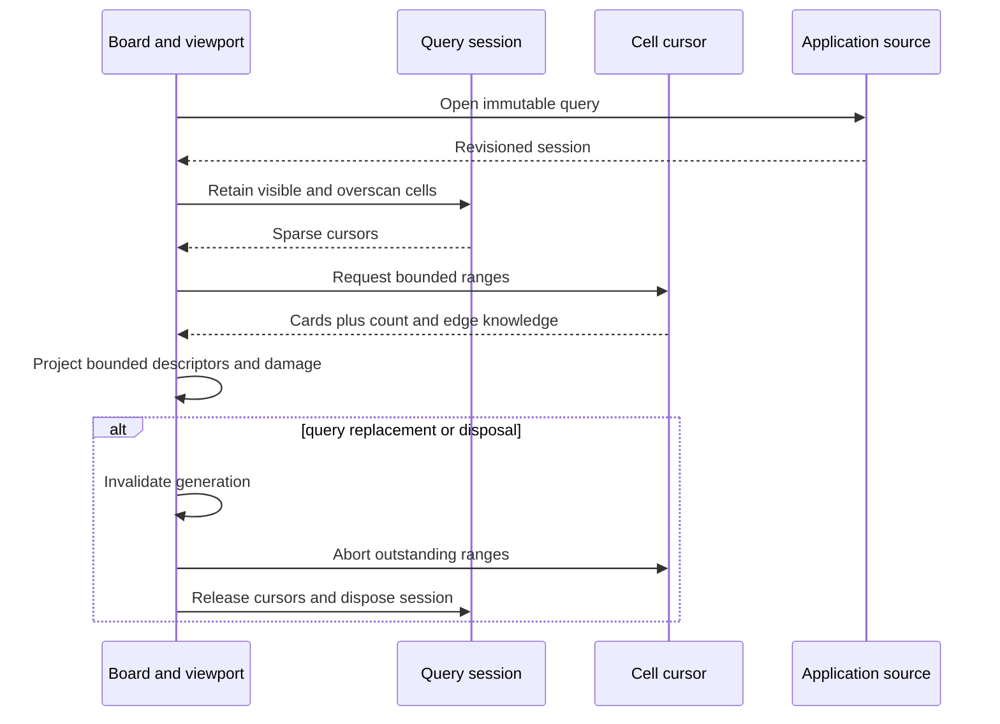

# Kanban architecture

> **Last Updated**: 2026-08-04
> **Status**: Phase A read-only foundation implemented; interaction and editing phases planned

## Boundary and ownership

`@jsvision/kanban` is a specialist JSVision package for presenting application-owned work records.
It owns bounded query, projection, layout, viewport, localization, and transient board-session state.
It does not own durable records, persistence, authorization, workflow policy, saved-view storage, or
window management.

Applications provide a `KanbanDataSource<TCard>`, a `KanbanCardAdapter<TCard>`, and a request
dispatcher. The optional `StandardCard` model is a convenience, not a required storage schema. A
board may be placed directly on an application surface or inside an application-owned window; both
hosts use the same board projection and lifecycle.

## Package topology

```mermaid
graph LR
    App[Application records and policy] --> Kanban[@jsvision/kanban]
    Kanban --> Core[@jsvision/core]
    Kanban --> I18n[@jsvision/i18n]
    Kanban --> UI[@jsvision/ui]
    UI --> Core
    App --> Host[Surface or window host]
    Host --> Kanban
```

| Public entry point                  | Purpose                                                      |
| ----------------------------------- | ------------------------------------------------------------ |
| `@jsvision/kanban`                  | Production contracts, sources, presentation, board, viewport |
| `@jsvision/kanban/testing`          | Deterministic fixtures and contract harnesses                |
| `@jsvision/kanban/locales/{locale}` | One reviewed locale catalog per explicit locale subpath      |

The package depends only on the public Core, I18n, and UI packages. Testing helpers are isolated from
the production module graph, and undeclared private subpaths are not part of the SDK surface.

## Read lifecycle

One mounted `KanbanBoard<TCard>` owns one `KanbanViewport<TCard>` and one read coordinator. The
coordinator opens a revisioned query session, then retains cell cursors only for visible, overscan,
or explicit prefetch owners. A cell is the intersection of a workflow column and the optional single
swimlane dimension.



Loaded range boundaries are never treated as logical board edges. Counts and edges remain exact,
lower-bound, estimated, truncated, loading, failed, or unknown according to source evidence. Query
replacement invalidates the generation before cancellation, so late work cannot publish into a new
session. Disposal is idempotent and cannot remount the source lifecycle.

## Responsive board and bounded viewport

The board uses the public layout DSL for ordinary composition and owns one measured viewport leaf for
exact terminal-cell projection. This isolates clipping, sticky headers, scrolling, hit testing,
damage, and stable anchors without duplicating responsive layout across the entire component.

The width solver degrades monotonically through wide, compact, focused-column, and minimum modes.
The viewport supports horizontal and vertical scrolling, preserves stable card and column anchors
across resize and reorder, and renders only visible plus bounded overscan ranges. Descriptor caching
is bounded, keyed by complete presentation semantics, and evicts work that loses all visible or
overscan ownership. Invalid or throwing application projections degrade to sanitized, non-color-only
fallbacks rather than leaking record content.

Phase A pointer inspection deliberately exposes no actionable card, insertion, or custom-action
targets. That keeps the read-only foundation honest while reserving exact geometry for the later
mouse interaction engine.

## Request authority

All future mutation paths—pointer, keyboard, dialogs, commands, and programmatic calls—share the
same discriminated request dispatcher. Capability metadata may hide or disable controls, but only the
application authorizes and applies a request. The component never mutates an application record
optimistically and reconciles only from dispatcher results and authoritative source publication.

## Phase boundary

| Implemented in Phase A                                      | Deliberately deferred                                   |
| ----------------------------------------------------------- | ------------------------------------------------------- |
| Public contracts, validation, limits, and semantic defaults | Drag ghosts, insertion targets, and card movement       |
| Eager and sparse revisioned read sources                    | Keyboard command/keymap completion and selection policy |
| Generic card adapters and bounded descriptors               | Rich checklist/summary rendering and custom card labs   |
| Theme roles, English fallback, and ten locale entry points  | Card editors and lane-configuration dialogs             |
| Responsive board/viewport, scrolling, and host parity       | Workflow enforcement and application persistence        |
| Request and reconciliation contracts                        | Component teaching page, live labs, and kitchen sink    |

This boundary is intentionally publishable and testable, but it is not presented as a complete
Kanban application. Later phases add interaction and package-owned input UI while retaining the
application authority, query lifecycle, bounded rendering, localization, and responsive-layout
decisions documented here.

## Related architecture

- [Kanban data model](/architecture/data-model)
- [Kanban API design](/architecture/api-design)
- [Kanban security architecture](/architecture/security)
- [Kanban architecture decisions](/decisions/)
