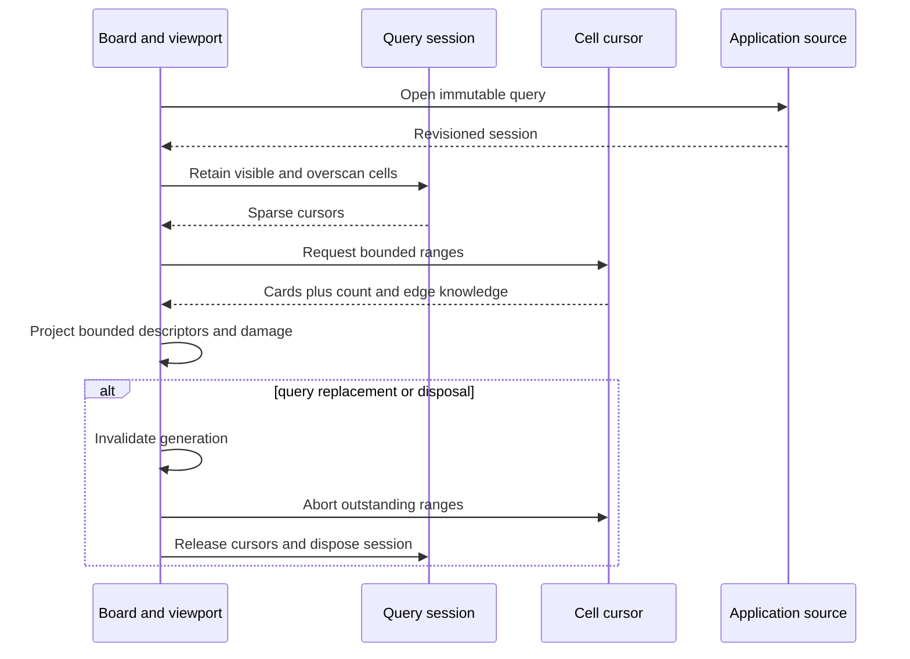
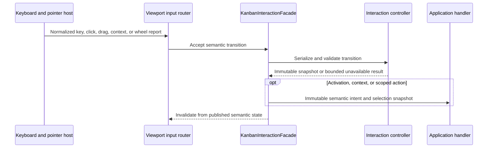

# Kanban architecture

> **Last Updated**: 2026-08-12
> **Status**: Phase C modern interaction implemented; editors, commands, and product documentation planned

## Boundary and ownership

`@jsvision/kanban` is a specialist JSVision package for presenting application-owned work records.
It owns bounded query, projection, scene geometry, layout, viewport, localization, and transient
interaction state. It does not own durable records, persistence, authorization, workflow policy,
saved-view storage, or window management.

Applications provide a `KanbanDataSource<TCard>` and `KanbanCardAdapter<TCard>`. They may also provide
a request dispatcher, semantic interaction handler, or replacement interaction-controller factory.
The optional `StandardCard` model is a convenience, not a required storage schema. A board may be
placed directly on an application surface or inside an application-owned window; both hosts use the
same projection, input, and lifecycle path.

## Package topology

```mermaid
graph LR
    App[Application records and policy] --> Kanban[@jsvision/kanban]
    Kanban --> Core[@jsvision/core]
    Kanban --> I18n[@jsvision/i18n]
    Kanban --> UI[@jsvision/ui]
    UI --> Core
    App --> Host[Surface or window host]
    Host --> Kanban
```

| Public entry point                  | Purpose                                                               |
| ----------------------------------- | --------------------------------------------------------------------- |
| `@jsvision/kanban`                  | Production sources, presentation, scene, interaction, board, viewport |
| `@jsvision/kanban/testing`          | Deterministic source, scene, input, and contract fixtures             |
| `@jsvision/kanban/locales/{locale}` | Foundation plus reviewed Phase B and Phase C overlays per subpath     |

The package depends only on the public Core, I18n, and UI packages. Testing helpers are isolated from
the production module graph, and undeclared private subpaths are not part of the SDK surface.

## Read lifecycle

One mounted `KanbanBoard<TCard>` owns one `KanbanViewport<TCard>` and one read coordinator. The
coordinator opens a revisioned query session, then retains cell cursors only for visible, overscan,
or explicit prefetch owners. A cell is the intersection of a workflow column and the optional single
swimlane dimension.



Loaded range boundaries are never treated as logical board edges. Counts and edges remain exact,
lower-bound, estimated, truncated, loading, failed, or unknown according to source evidence. Query
replacement invalidates the generation before cancellation, so late work cannot publish into a new
session. Disposal is idempotent and cannot remount the source lifecycle.

## Responsive board and bounded viewport

The board uses the public layout DSL for ordinary composition and owns one measured viewport leaf for
exact terminal-cell projection. This isolates clipping, sticky headers, scrolling, hit testing,
damage, and stable anchors without duplicating responsive layout across the entire component.

The width solver degrades monotonically through wide, compact, focused-column, and minimum modes.
The viewport supports horizontal and vertical scrolling, preserves stable card and column anchors
across resize and reorder, and renders only visible plus bounded overscan ranges. Descriptor caching
is bounded, keyed by complete presentation semantics, and evicts work that loses all visible or
overscan ownership. Invalid or throwing application projections degrade to sanitized, non-color-only
fallbacks rather than leaking record content.

The canonical scene contains clipped column/swimlane headers, variable-height cards, state surfaces,
and final semantic action targets. A sparse height index and immutable retained-row projection keep
vertical work bounded. Action regions are translated through card crop offsets before clipping, so
pointer targets agree with the final cells even when a descriptor is partially visible. Scene damage
is computed from semantic identity and geometry changes instead of repainting the complete board.

## Workflow structure and grouping

Phase B normalizes application-owned workflow policy before scene construction. Column visibility,
collapse, widths, WIP limits, definition-of-done text, capabilities, and semantic styles are copied
into immutable snapshots. WIP and transition evaluators are pure eligibility checks: their result
can explain what the component should present, but it never authorizes a mutation.

One query-selected grouping field may create one horizontal swimlane dimension. Derived resolvers
and explicit source memberships both produce stable semantic groups, while hidden membership stays
detached from the visible projection. Missing or unmapped values use an application-configured
unassigned group. Resolver failures use a separately configured local fallback and emit only
payload-free observations. Invalid structures retain the caller's previous complete result.

Built-in `hybrid`, `separator`, `band`, and `rail` chrome strategies share the same semantic
membership. Custom chrome is exact-shape validated, bounded, and prevented from creating card or
drop targets. Its resolver cache keys every output-affecting semantic and geometry input and has a
fixed FIFO bound. Collapsed-swimlane hover expansion is a temporary generation-owned lease: it does
not mutate saved collapse state, and scheduler failure, cancellation, leave, or disposal safely
restores the underlying projection.

## Request authority

The board owns one operation coordinator shared by pointer, keyboard, programmatic, editor, menu, and
structural producers. Admission validates a detached proposal and semantic placement, reserves its
affected identities, and publishes `proposed` then `pending` before exactly one dispatcher call.
Warnings and destructive proposals pass through the application confirmer while the same reservation
remains held. Conflicts fail closed; bounded active, retained-ID, and undo registries prevent duplicate
or unbounded operation state.

An accepted result does not mutate records. It retains a payload-free pending projection and optional
publication expectation until the application publishes its own source update and explicitly calls
`reconcilePublication`. Exact matching/confirmation commits; correlated contradiction or deletion
supersedes. Rejection, cancellation, stale work, or disposal releases reservations before notifying
observers, and late asynchronous settlements cannot revive a retired generation. Capability metadata
may hide or disable controls, but only the application authorizes and applies a request.

## Interaction and input lifecycle

Each `KanbanBoard` owns one stable `KanbanInteractionFacade`. On mount, the board creates or receives
one `KanbanInteractionController`, then transfers exclusive lifecycle ownership to the facade. The
controller owns immutable focus, bounded selection, range anchor, pending navigation, server-selection
reference, and feedback state. It receives bounded scene/source services rather than records, host
objects, or application handlers.

Standalone viewports can mirror the facade's immutable publications, but their non-owning adapter is
read-only. The owning board attaches synchronous keyboard/pointer authority through a separate
internal mount seam, so passing `board.interaction()` to another viewport cannot create a second input
owner.



Arrow/Home/End/Page navigation, Shift range extension, Space toggle, Ctrl+A loaded selection, Enter
activation, Escape cancellation, click/Ctrl-click/double-click/right-click, descriptor actions, retry,
drag, and wheel scrolling share this mounted path. Unknown and Alt-modified keys propagate to the
containing application. Pointer release commits only when button, semantic target, and scene revision
still match. Crossing the movement threshold converts the press into a capture-backed drag. Card drags
retain immutable source/revision evidence for one card or the ordered loaded selection, render a
bounded ghost and source placeholders, and resolve only semantic resting-gutter placement. Structural
drags use stable neighbor identities. Visual indices never cross the request boundary.

The shared UI event loop exposes a generation-bound pointer-capture lease with synchronous,
reasoned loss notification across replacement, modal, host, unmount, stop, and disposal boundaries.
The Kanban drag controller owns that lease and cancels synchronously on focus/capture loss, Escape,
resize, relevant source or policy change, unmount, and disposal. Edge autoscroll owns at most one timer
per drag generation, applies bounded steps, and rebuilds semantic targets after each successful move.
Collapsed-swimlane expansion is likewise a temporary generation-owned lease.

`open-card`, `open-context`, and `scoped-action` intents cross a synchronous application handler only
after required focus/selection work settles. They carry identities and closed scopes, never record
payloads or mutation authority. The stable facade also exposes the same operations programmatically.
Setup, transition, handler, and late-settlement failures retain the last valid detached snapshot and
degrade to bounded unavailable feedback.

Teardown first quiesces mounted input, then releases facade/controller subscriptions and cancellation,
viewport scene/session ownership, and finally board request authority. Disposal is idempotent, and a
released board cannot remount.

## Phase boundary

| Implemented modern-interaction foundation                                 | Deliberately deferred                                     |
| ------------------------------------------------------------------------- | --------------------------------------------------------- |
| Generic sources, bounded rendering, responsive layout, and one swimlane   | Nested grouping                                           |
| Rich cards, themes, ten locales, keyboard, click, and capture-backed drag | Command registry and user-remappable keymap               |
| Semantic card/structure placement and atomic selected-block movement      | Card and lane-configuration dialogs                       |
| One coordinator, confirmation, lifecycle, publication, cancellation       | Application persistence and authorization implementations |
| Direct, xterm, PTY/ConPTY evidence and permanent kitchen-sink story       | Full component teaching page and focused docs-site labs   |

The package remains a component foundation rather than a complete Kanban application. Later phases
add package-owned input UI and command/documentation surfaces while preserving application authority,
bounded query/rendering, semantic placement, localization, and responsive layout.

## Related architecture

- [Kanban data model](/architecture/data-model)
- [Kanban API design](/architecture/api-design)
- [Kanban security architecture](/architecture/security)
- [Kanban architecture decisions](/decisions/)
