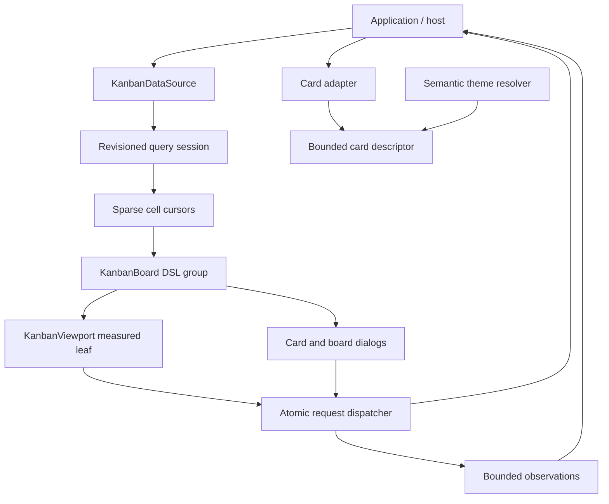

# System overview

> **Last Updated**: 2026-08-11

## Architecture style

JSVision is a modular TypeScript SDK monorepo. Public packages form a layered library rather than a
runtime service: applications instantiate components locally, retain authority over their data and
effects, and select terminal or browser hosts. The Kanban foundation now exists as the specialist
`@jsvision/kanban` package under `packages/`, following the Data Grid and Code Editor precedent. Its
contract, source/session, presentation-adapter, descriptor, theme, English fallback catalog, and
workflow-structure layers are implemented; canonical scene and dialog layers remain staged work.

## Kanban component architecture

## Component responsibilities

### `KanbanBoard<TCard>`

- **Purpose**: Compose board chrome, state surfaces, dialogs, and the viewport.
- **Technology**: Public JSVision layout DSL and reactive ownership.
- **Inputs**: Data source, adapters, capabilities, theme, locale, and configuration.
- **Outputs**: Rendered board, commands, atomic requests, and bounded observations.
- **Boundary**: It never becomes the durable owner of application records.

### `KanbanViewport<TCard>`

- **Purpose**: Render the visible card window and own exact terminal-cell interaction geometry.
- **Technology**: One measured custom view inside the DSL-composed board.
- **Inputs**: Assigned rectangle, visible sparse cursors, focus, selection, and drag state.
- **Outputs**: Damage-limited rendering, hit-test results, scroll changes, and semantic placements.
- **Boundary**: Raw cell geometry is isolated here; ordinary chrome remains DSL-composed.

### Query session and cell cursors

- **Purpose**: Give one coherent board revision and lazily load visible column/swimlane cells.
- **Inputs**: Search, filter, sort, grouping, and saved-view projection.
- **Outputs**: Bounded card windows, count knowledge, logical-edge knowledge, and errors per cell.
- **Boundary**: One failed cell does not invalidate unrelated loaded cells.

The implemented source boundary uses one immutable semantic query per session, honest count-quality
unions, revision-scoped placements, and collision-safe column/swimlane addresses. A generation-owned
coordinator retains cursors only for explicit visible, overscan, or prefetch owners. Query replacement
invalidates the old generation before aborting outstanding work, so late completions cannot publish
into the new session.

Small boards use the reactive eager adapter without changing this contract. Large or remote adapters
can expose sparse windowed cursors; the deterministic testing adapter demonstrates 100,000 logical
cards while materializing only requested visible and overscan ranges.

### Card presentation boundary

- **Purpose**: Project arbitrary application records into bounded, immutable terminal content.
- **Inputs**: A generic card adapter, exact-cell render context, semantic theme, and locale formatters.
- **Outputs**: Validated rows, sections, actions, hit regions, degradation evidence, and non-color cues.
- **Boundary**: Accessors, hostile prototypes, control text, invalid geometry, and throwing renderers
  are isolated before any descriptor reaches the future viewport.

The standard renderer deliberately covers only title, status, and interaction-state cues in this
foundation slice. Rich summaries and checklist previews remain represented in the public descriptor
vocabulary but are not rendered until their later implementation phase.

### Workflow structure boundary

- **Purpose**: Normalize workflow columns, the optional single swimlane dimension, and pure
  WIP/definition-of-done/transition eligibility before scene construction.
- **Inputs**: Application-owned structure policy, active query grouping, optional derived resolvers
  or explicit memberships, and responsive presentation constraints.
- **Outputs**: Immutable visible and detached structure snapshots, bounded swimlane chrome, and
  temporary collapsed-hover lease state.
- **Boundary**: Eligibility never grants authorization; custom resolvers and chrome cannot inject
  card/drop targets or leak record payloads through observations.

### UI pointer-capture lifecycle

- **Purpose**: Give cleanup-sensitive mouse gestures immediate, reasoned notification when capture
  ends outside their normal pointer-up path.
- **Technology**: A generation-bound `EventLoop.acquireCapture()` lease layered over the legacy
  `setCapture()`, `hasCapture()`, and `releaseCapture()` compatibility surface.
- **Inputs**: A mounted target view and a synchronous capture-loss callback.
- **Outputs**: One detachable lease plus one bounded loss reason for replacement, explicit release,
  modal transitions, host lifecycle loss, unmount, stop, or disposal.
- **Boundary**: This is reusable UI infrastructure. Kanban's drag controller and insertion/drop
  presentation remain later work; see [ADR-014](/decisions/ADR-014-generation-bound-pointer-capture).

### Application request dispatcher

- **Purpose**: Receive every create, edit, move, configure, bulk, and history intent through one
  discriminated request contract.
- **Inputs**: Normalized identifiers, semantic placements, expected revision, and bounded tokens.
- **Outputs**: Pending, commit, or rejection state published by the application.
- **Boundary**: Capability checks guide the UI but never replace host authorization.

## Communication patterns

| From            | To            | Protocol                    | Pattern               | Notes                                              |
| --------------- | ------------- | --------------------------- | --------------------- | -------------------------------------------------- |
| Board           | Query session | Typed in-process API        | Async, cancellable    | Revisioned and windowed                            |
| Viewport/dialog | Dispatcher    | Discriminated request       | Async, atomic         | Same path for mouse, keyboard, and programmatic UI |
| Application     | Board         | Reactive source publication | Push/requery          | Application remains authoritative                  |
| Board           | Application   | Observation callback/stream | Bounded, content-safe | Telemetry is not persistence                       |

## Cross-cutting concerns

- **Responsiveness**: DSL composition reflows all ordinary surfaces; the viewport responds to its
  measured rectangle and supports wide, compact, and focused-column modes.
- **Errors**: Source, request, dialog, and rendering failures remain local and recoverable.
- **Accessibility**: Keyboard parity, visible focus, non-color cues, ASCII-safe fallbacks, and narrow
  geometry are architectural requirements.
- **Lifecycle**: Disposal cancels loads, validators, drag capture, timers, and observations.
- **Observability**: Events are bounded and exclude card payloads unless the application explicitly
  supplies safe metadata.
