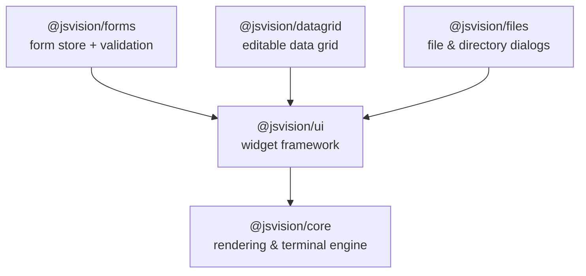

# Install & packages

JSVision ships as a small family of packages. Most applications need exactly one of them; the rest
are additions you reach for when you need what they do.

## Requirements

|                          |                                                                 |
| ------------------------ | --------------------------------------------------------------- |
| **Node.js**              | 22 or newer                                                     |
| **Module format**        | ESM only — see [ESM only, no `require()`](#esm-only-no-require) |
| **Runtime dependencies** | none                                                            |

That last row is a design constraint, not a coincidence: the engine is pure JavaScript with no
native addons, so it installs and runs anywhere Node does — no build step, no prebuilt binaries to
go wrong.

## Install

For most applications, one command is the whole setup:

::: code-group

```sh [npm]
npm install @jsvision/ui
```

```sh [yarn]
yarn add @jsvision/ui
```

```sh [pnpm]
pnpm add @jsvision/ui
```

:::

`@jsvision/ui` depends on `@jsvision/core`, so your package manager installs both. You do not need to
list `@jsvision/core` yourself unless you are using the engine directly, without the widget
framework.

## The packages



| Package                  | What it is                                                                                                                        | Install it when                                                                        |
| ------------------------ | --------------------------------------------------------------------------------------------------------------------------------- | -------------------------------------------------------------------------------------- |
| **`@jsvision/ui`**       | The widget framework: application shell, windows, dialogs, the layout engine, reactive signals, and the full widget set.          | Almost always — this is the one you build with.                                        |
| **`@jsvision/core`**     | The foundation engine underneath: capability detection, input decoding, the damage-diff renderer, the terminal host, and theming. | You want the engine without the widgets, or you are building your own rendering layer. |
| **`@jsvision/forms`**    | A headless form store with Zod schema validation and opt-in async field validation.                                               | Your app has forms with real validation rules.                                         |
| **`@jsvision/datagrid`** | An editable, enterprise-class data grid: typed columns, sorting, filtering, aggregates, and master-detail.                        | You need a spreadsheet-grade table, not a simple list.                                 |
| **`@jsvision/files`**    | File-open, save, and directory-picker dialogs, backed by an injectable file-system seam.                                          | Your app opens or saves files.                                                         |

Each of `forms`, `datagrid`, and `files` depends on `@jsvision/ui` — and through it on
`@jsvision/core` — so installing any one of them brings the framework with it.

## Which packages do I need?

::: code-group

```sh [A terminal app]
npm install @jsvision/ui
```

```sh [With forms]
npm install @jsvision/ui @jsvision/forms zod
```

```sh [With a data grid]
npm install @jsvision/ui @jsvision/datagrid
```

```sh [With file dialogs]
npm install @jsvision/ui @jsvision/files
```

:::

Combine them freely — they are additive, and they share the same `@jsvision/core` underneath.

## Start a new project

From an empty directory to a running application:

```sh
mkdir my-app && cd my-app
npm init -y
npm install @jsvision/ui
npm install --save-dev typescript tsx @types/node
```

Mark the project as ESM by adding `"type": "module"` to its `package.json`, then create a
`tsconfig.json`:

```json
{
  "compilerOptions": {
    "target": "ES2022",
    "module": "NodeNext",
    "moduleResolution": "NodeNext",
    "strict": true,
    "skipLibCheck": true,
    "noEmit": true
  },
  "include": ["src/**/*.ts"]
}
```

`module` and `moduleResolution` must **both** be `NodeNext`. JSVision publishes ESM behind an
`exports` map, and the older resolvers cannot read it — that mismatch is the usual cause of "cannot
find module `@jsvision/ui`" when the package is plainly installed.

Now write `src/main.ts` — the [Introduction](/guide/#your-first-application) has a complete first
application to paste in — and run it:

```sh
npx tsx src/main.ts
```

A JSVision app draws on an **interactive terminal**, so run it directly in one. If its output is
piped or it runs in a CI job there is no TTY to draw on, which is worth guarding for explicitly:

```ts
if (process.stdout.isTTY !== true) {
  process.stdout.write('This app needs an interactive terminal (TTY).\n');
  process.exit(0);
}
```

::: tip Scaffolding
A `npm create jsvision` one-liner that generates a runnable starter for you is planned — follow
[issue #169](https://github.com/blendsdk/jsvision/issues/169). Until it lands, the steps above are
the supported path. If you use Claude Code, this repository also ships a `/jsvision-new-app` skill
that scaffolds a starter package, though it generates into a JSVision monorepo checkout rather than
a standalone project.
:::

## Things to know

### ESM only, no `require()`

Every package is ESM-only and publishes no CommonJS build, so `require('@jsvision/ui')` will not
work. Use a static import:

```ts
import { createApplication } from '@jsvision/ui';
```

From a CommonJS file, a dynamic import still works:

```js
const { createApplication } = await import('@jsvision/ui');
```

### Peer dependencies

Only one package has a peer dependency: `@jsvision/forms` needs **Zod 4** and deliberately does not
bundle it, so your application controls the version and there is only ever one copy of Zod in the
dependency tree.

```sh
npm install @jsvision/forms zod
```

`@jsvision/core` and `@jsvision/ui` have no peer dependencies and no runtime dependencies at all.

### Running in a browser

JSVision applications also run unchanged in a web page — every live example on this site is a real
application mounted into an xterm.js terminal by `@jsvision/web`. That package is currently
**internal to this repository and is not published to npm**, so browser deployment is not yet
something you can set up in your own project. Terminal applications are fully supported today.

## Where to next

- **[Introduction](/guide/)** — what JSVision is, and your first complete application.
- **[Components](/components/)** — every widget, with a live example on each page.
- **[API reference](/api/)** — the generated reference for every public symbol.
